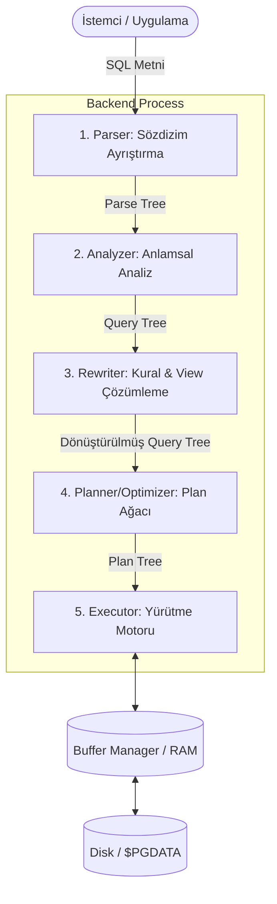

# Sorgu Motoru Yaşam Döngüsü ve Fiziksel Küme Mimarisi

> **Bölüm Kapsamı:** Bir SQL Sorgusunun 5 Motor Aşaması (Parser, Analyzer, Rewriter, Planner, Executor), OID vs relfilenode, Dosya Çatalları (FSM/VM) ve $PGDATA Fiziksel Dizin Mimarisi

---

PostgreSQL, dünyadaki en gelişmiş açık kaynak sorgu işleme motoruna ve sağlam bir fiziksel depolama mimarisine sahiptir. Bu rehber; istemciden gelen bir SQL metninin diske ve belleğe ulaşana kadar geçtiği iç aşamaları ve `$PGDATA` veri dizininin fiziksel düzenini derinlemesine açıklar.

---

## 1. Sorgu İşleme Yaşam Döngüsü (Query Processing Lifecycle)

İstemci (psql, backend uygulaması vb.) sunucuya bir SQL sorgusu gönderdiğinde, bu sorgu o istemciye özel tahsis edilmiş arka uç süreci (**Backend Process**) tarafından sırasıyla 5 temel alt sistemden geçirilir:



### a. 1. Aşama: Parser (Sözdizimsel Ayrıştırıcı)

Parser, düz metin (ASCII/UTF-8) halindeki SQL ifadesini girdi olarak alır ve dilbilgisi kurallarına göre bir **Ayrıştırma Ağacı (Parse Tree)** üretir.

- **Kaynak Kod:** PostgreSQL kaynak kodunda `parsenodes.h` dosyasında tanımlanan `SelectStmt`, `InsertStmt` gibi C yapılarını (struct) kullanır.
- **Kapsam:** Parser **yalnızca sözdizimi (syntax)** kontrol eder. Tablonun veya kolonların veritabanında gerçekten var olup olmadığını **BİLMEZ**.
- **Hata Durumu:** `FORM` yerine yanlışlıkla `FROM` yazarsanız parser `syntax error` fırlatır; ancak var olmayan bir tablo adı yazarsanız bu aşamadan başarıyla geçer.

### b. 2. Aşama: Analyzer / Semantic Analysis (Anlamsal Denetim)

Analyzer, parse tree'yi alır ve sistem kataloglarına (`pg_class`, `pg_attribute`, `pg_type`) başvurarak **anlamsal doğrulama** yapar.

1. Sorgudaki tablo ve kolonlar mevcut mu?
2. Kullanıcının bu nesneleri okuma/yazma izni var mı?
3. Veri tipleri ve fonksiyon argümanları uyuşuyor mu?
4. `SELECT *` ifadesi tablodaki gerçek kolon listesiyle genişletilir.

Doğrulama başarılı olduğunda kök düğümü `Query` yapısında olan bir **Sorgu Ağacı (Query Tree)** oluşturulur:
- `targetList`: İstenen kolonların listesi.
- `rtable` (Range Table): Sorguda referans verilen ilişkiler (tablolar/view'lar).
- `jointree`: `FROM` ve `WHERE` yan tümcelerini içeren mantıksal birleşim ağacı.

### c. 3. Aşama: Rewriter (Kural Sistemi ve View Genişletici)

Rewriter, sistem kataloğundaki (`pg_rules`) kuralları Query Tree'ye uygular. En yaygın görevi **View (Görünüm)** genişletmesidir.

- Bir sorgu `SELECT * FROM active_users_view;` içeriyorsa, Rewriter bu view'ın arka planındaki asıl SQL sorgusunu (`SELECT ... FROM users WHERE is_active = true`) Query Tree içine yerleştirir.
- View'lar PostgreSQL'de sanal tablolardır; Rewriter aşamasında alt sorgu (subquery) olarak ana ağaca kaynaştırılırlar.

### d. 4. Aşama: Planner / Optimizer (Sorgu Planlayıcı)

Sorgu motorunun en zeki ve hesaplama açısından en yoğun parçasıdır. Girdi olarak dönüştürülmüş Query Tree'yi alır ve Executor'ın doğrudan işleyebileceği bir **Plan Ağacı (Plan Tree / PlannedStmt)** üretir.

- **İstatistik Değerlendirmesi:** `pg_statistic` tablosundaki verileri (veri dağılımı, NULL oranları, histogramlar, en sık geçen değerler - MCV) inceler.
- **Yol Simülasyonu:** Tabloya Sequential Scan ile mi yoksa Index Scan / Bitmap Scan ile mi erişilmeli? Birden fazla tablo varsa Nested Loop, Hash Join veya Merge Join algoritmalarından hangisi en ucuzdur?
- **Maliyet (Cost) Hesabı:** Disk I/O (`seq_page_cost`, `random_page_cost`) ve CPU maliyetlerini toplayarak en düşük toplam maliyetli (lowest total cost) yürütme planını seçer.
- `EXPLAIN` komutu ile ekranda gördüğümüz çıktı, Planner'ın ürettiği bu Plan Tree'nin metinsel görselleştirmesidir.

### e. 5. Aşama: Executor (Yürütme Motoru)

Executor, Plan Tree'nin en altındaki yaprak düğümlerden başlayarak kök düğüme doğru işlem yapar (Volcano / Iterator Modeli).

- **On-Demand (Demand-Driven) Çalışma:** Her plan düğümü üst düğümün çağrısıyla satır satır (`ExecProcNode`) çalışır. Örneğin bir `Limit 10` düğümü varsa, altındaki sıralama veya tarama düğümünden sadece 10 satır üretilene kadar veri ister, fazlasını çalıştırmaz.
- **Bellek ve I/O Etkileşimi:** Executor doğrudan diske gitmez; **Buffer Manager** üzerinden `shared_buffers` havuzundaki 8 KB'lık sayfaları talep eder. Sayfa bellekte yoksa diskten RAM'e okunur.
- **Geçici Dosyalar:** Sıralama veya Hash işlemleri `work_mem` sınırını aşarsa, Executor disk üzerinde geçici çalışma dosyaları (`pgsql_tmp`) açarak işlemi tamamlar.

---

## 2. Fiziksel Küme Mimarisi: OID vs relfilenode

PostgreSQL'de her veritabanı nesnesinin iki farklı kimliği vardır: **Mantıksal Kimlik (OID)** ve **Fiziksel Dosya Kimliği (relfilenode)**.

```sql
SELECT relname, oid, relfilenode, pg_relation_filepath(oid)
FROM pg_class
WHERE relname = 'musteriler';
```

| Kavram | Açıklama | Davranış |
| :--- | :--- | :--- |
| **OID (Object Identifier)** | Tablonun sistem kataloğundaki değişmez mantıksal kimliğidir. | Tablo yeniden oluşturulmadığı (`DROP + CREATE`) sürece **asla değişmez**. |
| **relfilenode** | Tablonun disk üzerindeki fiziksel dosyasının adıdır. | Belirli bakım işlemlerinde **değişir**. |

### relfilenode Neden ve Ne Zaman Değişir?

PostgreSQL'de aşağıdaki komutlar çalıştırıldığında eski disk dosyası çöpe atılır ve diskte sıfırdan yepyeni bir dosya oluşturulur:
- `TRUNCATE musteriler;`
- `VACUUM FULL musteriler;`
- `CLUSTER musteriler USING musteriler_pkey;`
- `REINDEX TABLE musteriler;`
- `ALTER TABLE musteriler SET TABLESPACE fast_ssd;`

Bu işlemler tamamlandığında tablonun `OID` değeri aynı kalırken, `relfilenode` değeri değişir ve diskteki dosya yeni numarayı alır.

---

## 3. Tablo Dosya Segmentasyonu ve Çatal (Fork) Mimarisi

PostgreSQL dosya sistemlerinin ve işletim sistemlerinin eski dosya boyutu limitlerine (2 GB sınırı gibi) takılmamak ve dosya yönetimini optimize etmek için tabloları parçalar.

### a. 1 GB Segment Sınırı
Bir tablo veya indeksin boyutu 1 GB'ı aştığında, PostgreSQL bu dosyayı bölerek yeni dosyalar açar:
- `18740` (0 - 1 GB arası ilk veri bloğu)
- `18740.1` (1 GB - 2 GB arası ikinci blok)
- `18740.2` (2 GB - 3 GB arası üçüncü blok)

### b. İlişki Çatalları (Relation Forks)

Diskteki her tablonun yanında sadece ham veriler değil, performansı artıran yardımcı çatal dosyaları da bulunur:

| Çatal (Fork) | Dosya Uzantısı | Görevi ve Önemi |
| :--- | :--- | :--- |
| **Main Fork** | *(Uzantısız)* `18740` | Tablonun veya indeksin gerçek verilerini (8 KB'lık sayfalar halinde) tutan ana dosya. |
| **FSM (Free Space Map)** | `18740_fsm` | Sayfalar içindeki boş alanların haritasıdır. Yeni satır (`INSERT`) ekleneceği zaman tüm sayfaları taramak yerine doğrudan boş yeri olan sayfayı bulur. |
| **VM (Visibility Map)** | `18740_vm` | Sayfadaki satırların tüm aktif transaction'lar için görünür olup olmadığını tutan 2-bitlik harita. **Index-Only Scan** hızlandırması ve `VACUUM` optimizasyonu için hayati önem taşır. |
| **Init Fork** | `18740_init` | Sadece `UNLOGGED` tablolarda bulunur. Sunucu çöktüğünde (crash) unlogged tabloyu başlangıçtaki boş haline döndürmek için kullanılan şablon dosyadır. |

---

## 4. $PGDATA Fiziksel Dizin Kataloğu

PostgreSQL kümesinin disk üzerindeki ana dizini (`$PGDATA`), veritabanı motorunun tüm alt bileşenlerini barındırır. Aşağıdaki tablo, bu dizinlerin kurumsal DBA gözüyle eksiksiz fihristidir:

| Dizin / Dosya | İçerik ve Amacı |
| :--- | :--- |
| **`PG_VERSION`** | Kümenin majör PostgreSQL sürüm numarasını içeren düz metin dosya (örn: `16`). |
| **`postgresql.conf`** | Ana yapılandırma dosyası (parametreler, bellek, bağlantı ayarları). |
| **`postgresql.auto.conf`** | `ALTER SYSTEM` komutlarıyla yapılan değişikliklerin otomatik yazıldığı dosya. |
| **`pg_hba.conf`** | İstemci kimlik doğrulama kuralları (Host-Based Authentication). |
| **`pg_ident.conf`** | İşletim sistemi kullanıcıları ile PostgreSQL rolleri arasındaki haritalama. |
| **`postmaster.pid`** | Çalışan ana postmaster sürecinin PID'sini, portunu ve soket yolunu tutan kilit dosyası. |
| **`base/`** | Veritabanlarının fiziksel verilerini tutan ana dizin. Her veritabanı kendi OID adıyla bir alt dizine sahiptir (`base/16384/` vb.). |
| **`global/`** | Tüm küme genelinde paylaşılan sistem tabloları (`pg_database`, `pg_authid`) ve `pg_control` dosyasını barındırır. |
| **`pg_wal/`** | Write-Ahead Log (WAL) segment dosyalarının (`16 MB` her biri) yazıldığı dizin. En kritik I/O dizinidir. |
| **`pg_xact/`** | Tüm transaction'ların commit/abort durumunu tutan durum bitleri (CLOG). |
| **`pg_commit_ts/`** | `track_commit_timestamp = on` yapıldığında işlem zaman damgalarını saklar. |
| **`pg_multixact/`** | Paylaşımlı satır kilitleri (Shared Row Locks) için çoklu işlem durumu verileri. |
| **`pg_subtrans/`** | Savepoint ve alt transaction'ların (subtransactions) durum verileri. |
| **`pg_notify/`** | `LISTEN` / `NOTIFY` kuyruklarının durum verileri. |
| **`pg_tblspc/`** | `$PGDATA` dışındaki farklı disklere açılan Tablespace'lerin sembolik bağlarını (symlink) barındırır. |
| **`pg_replslot/`** | Fiziksel ve mantıksal replikasyon yuvalarının (Replication Slots) durum verileri. |
| **`pg_snapshots/`** | Dışa aktarılan anlık görüntü (`pg_export_snapshot()`) meta verileri. |
| **`pg_stat/`** | Sunucu kapatıldığında kümülatif istatistiklerin diske yazıldığı kalıcı istatistik alanı. |
| **`pg_stat_tmp/`** | İstatistik alt sisteminin çalışma anındaki geçici verileri (RAM disk / tmpfs önerilir). |
| **`pg_twophase/`** | İki aşamalı commit (`PREPARE TRANSACTION`) durum dosyaları. |
| **`pg_logical/`** | Mantıksal çözme (Logical Decoding) eşleme durumları. |
| **`pg_dynshmem/`** | Paralel sorgular için dinamik paylaşımlı bellek dosyaları. |

> [!CAUTION]
> **DBA Güvenlik Kuralı:** `$PGDATA` altındaki dosyaları (özellikle `global/pg_control`, `pg_wal/` ve `base/` altındaki dosyaları) asla işletim sistemi seviyesinde manuel olarak silmeyin veya düzenlemeyin. Bu işlem doğrudan veritabanı kümesinin bozulmasına (corruption) yol açar.
