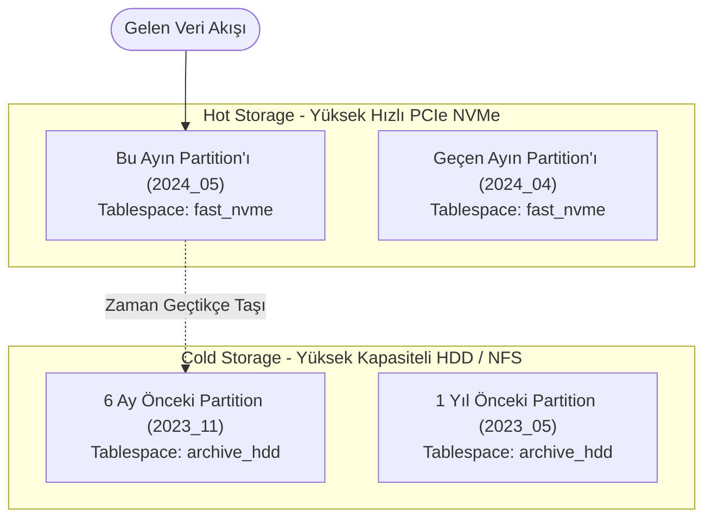

# Tablespace Mimarisi, Depolama Katmanlama ve Veri Yaşlandırma

> **Bölüm Kapsamı:** Tablespace Yönetimi, Farklı Disk Katmanları (NVMe/SSD/HDD), Canlı Tablo Taşıma, `temp_tablespaces` Optimizasyonu ve Veri Yaşlandırma (Hot/Cold Tiering)

---

PostgreSQL'de varsayılan olarak tüm veritabanları ve tablolar `$PGDATA/base` dizini altında aynı dosya sisteminde saklanır. Ancak kurumsal üretim ortamlarında veriler homojen değildir; son 24 saatin sipariş verileri ile 5 yıl öncesinin arşiv kayıtları aynı I/O gereksinimine sahip değildir. 

**Tablespace**, veritabanı yöneticisinin (DBA) belirli tabloları, indeksleri veya geçici dosyaları işletim sistemindeki farklı fiziksel disklere (örneğin yüksek hızlı PCIe NVMe SSD'ler veya ucuz ve yüksek kapasiteli mekanik HDD dizileri) yönlendirmesini sağlayan güçlü bir depolama sanallaştırma mekanizmasıdır.

---

## 1. Varsayılan Tablespace'ler ve Temel Kavramlar

PostgreSQL kümesi başlatıldığında (`initdb`) otomatik olarak iki yerleşik tablespace tanımlanır:

| Tablespace Adı | Fiziksel Konumu | Kapsamı |
| :--- | :--- | :--- |
| **`pg_default`** | `$PGDATA/base` | Açıkça bir tablespace belirtilmediğinde tüm kullanıcı veritabanları, tabloları ve indeksleri buraya yazılır. |
| **`pg_global`** | `$PGDATA/global` | Tüm küme genelinde paylaşılan sistem katalog tablolarını (`pg_database`, `pg_authid`) barındırır. Kullanıcı nesneleri buraya eklenemez. |

---

## 2. Yeni Tablespace Oluşturma (Adım Adım)

Bir tablespace oluşturulmadan önce, hedeflenen fiziksel disk veya mount dizini işletim sistemi seviyesinde hazırlanmalıdır.

### Adım 1: İşletim Sistemi Seviyesinde Dizin ve İzinleri Ayarlama

PostgreSQL güvenlik gereği hedef dizinin tamamen **boş** olmasını ve sahibinin **postgres** kullanıcısı olmasını şart koşar:

```bash
# 1. Hızlı NVMe diski mount edilmiş bir dizin açın
sudo mkdir -p /mnt/fast_nvme/pg_tblspc
sudo mkdir -p /mnt/archive_hdd/pg_tblspc

# 2. Sahiplik ve izinleri sadece postgres kullanıcısına verin (0700)
sudo chown -R postgres:postgres /mnt/fast_nvme/pg_tblspc /mnt/archive_hdd/pg_tblspc
sudo chmod 700 /mnt/fast_nvme/pg_tblspc /mnt/archive_hdd/pg_tblspc
```

### Adım 2: SQL ile Tablespace Tanımlama

```sql
-- 1. Hızlı NVMe tablespace oluştur
CREATE TABLESPACE fast_nvme LOCATION '/mnt/fast_nvme/pg_tblspc';

-- 2. Arşiv amaçlı HDD tablespace oluştur
CREATE TABLESPACE archive_hdd LOCATION '/mnt/archive_hdd/pg_tblspc';

-- 3. Mevcut tablespace'leri ve yollarını sorgula
\db+
-- veya SQL ile:
SELECT spcname, pg_tablespace_location(oid) FROM pg_tablespace;
```

> [!CAUTION]
> **Tablespace Konumu Kuralı:** Tablespace dizini kesinlikle `$PGDATA` veri dizini içinde veya altında **olamaz**! `$PGDATA` dışındaki bağımsız bir yolda bulunmalıdır. PostgreSQL bu bağı `$PGDATA/pg_tblspc/` altında sembolik bir bağ (symlink) ile kurar.

### Adım 3: Kullanıcılara Yetki Verme

Bir kullanıcının nesnelerini belirtilen tablespace üzerinde oluşturabilmesi için `CREATE` yetkisine sahip olması gerekir:

```sql
GRANT CREATE ON TABLESPACE fast_nvme TO app_user;
```

---

## 3. Nesneleri Tablespace'e Atama ve Canlı Taşıma (Online Move)

### a. Nesne Oluştururken Belirtme

```sql
-- Tabloyu hızlı NVMe üzerinde oluştur
CREATE TABLE active_orders (
    id BIGSERIAL PRIMARY KEY,
    customer_id INT,
    amount NUMERIC,
    created_at TIMESTAMPTZ DEFAULT NOW()
) TABLESPACE fast_nvme;

-- Tablonun indeksini farklı bir tablespace'e koyabilirsiniz
CREATE INDEX idx_orders_customer ON active_orders (customer_id) TABLESPACE fast_nvme;
```

### b. Canlı Tablo Taşıma (ALTER TABLE ... SET TABLESPACE)

PostgreSQL, çalışan bir production sistemde tabloları ve indeksleri bir diskten diğerine kesintisiz (kısa süreli kilit ile) taşıyabilir:

```sql
-- 1. Tabloyu arşiv diskine taşı
ALTER TABLE audit_logs SET TABLESPACE archive_hdd;

-- 2. İndeksi hızlı diske taşı
ALTER INDEX idx_audit_created SET TABLESPACE fast_nvme;

-- 3. Bir veritabanının varsayılan tablespace'ini değiştir (Kimse bağlı değilken)
ALTER DATABASE report_db SET TABLESPACE fast_nvme;
```

> [!NOTE]
> `ALTER TABLE ... SET TABLESPACE` komutu tablonun fiziksel dosyasını taşırken `relfilenode` değerini değiştirir ve işlem süresince `ACCESS EXCLUSIVE` kilit alır. Bu nedenle yoğun yazma alan tablolarda bakım pencerelerinde veya düşük trafikli saatlerde yapılması tavsiye edilir.

---

## 4. `default_tablespace` ve `temp_tablespaces` Optimizasyonu

### a. Varsayılan Tablespace (`default_tablespace`)

Yeni oluşturulan tabloların varsayılan olarak hangi tablespace'e gideceğini oturum, kullanıcı veya veritabanı düzeyinde belirleyebilirsiniz:

```sql
-- Sadece mevcut oturum için:
SET default_tablespace = 'fast_nvme';

-- Belirli bir veritabanı için kalıcı:
ALTER DATABASE prod_db SET default_tablespace = 'fast_nvme';

-- Belirli bir kullanıcı için kalıcı:
ALTER ROLE analytics_user SET default_tablespace = 'archive_hdd';
```

### b. Geçici Dosyaları Hızlı Diske Yönlendirme (`temp_tablespaces`)

Büyük `ORDER BY`, `DISTINCT`, `HASH JOIN` ve `VACUUM` işlemleri `work_mem` sınırını aştığında diske geçici dosyalar (`pgsql_tmp`) yazar. Bu geçici I/O yükünün ana veritabanı diskini kilitlemesini engellemek için geçici tablespace tanımlanır:

```ini
# postgresql.conf
temp_tablespaces = 'fast_nvme, pg_default'
```
*PostgreSQL birden fazla geçici tablespace belirtildiğinde her yeni geçici dosyayı bu listeye round-robin / rastgele dağıtarak I/O yükünü dengeler.*

---

## 5. Veri Yaşlandırma (Data Aging) ve Hot/Cold Katmanlama Mimarisi

Büyük hacimli zaman serisi, finansal işlem veya log verilerinde maliyeti düşürmek ve performansı zirvede tutmak için **Declarative Partitioning + Tablespace** kombinasyonu uygulanır:



### Uygulama Örneği: Otomatik Partition Yaşlandırma

```sql
-- 1. Ana Bölümlenmiş Tablo
CREATE TABLE network_traffic (
    id BIGSERIAL,
    log_time TIMESTAMPTZ NOT NULL,
    bytes_sent BIGINT
) PARTITION BY RANGE (log_time);

-- 2. Aktif (Sıcak) Veri: Hızlı NVMe diskte oluşturulur
CREATE TABLE network_traffic_2024_05 PARTITION OF network_traffic
    FOR VALUES FROM ('2024-05-01') TO ('2024-06-01')
    TABLESPACE fast_nvme;

-- 3. Zamanı geçen eski partition arşiv diskine taşınır
ALTER TABLE network_traffic_2023_01 SET TABLESPACE archive_hdd;
```

### Veri Yaşlandırma Kazanımları:
1. **Maliyet Tasarrufu:** 10 TB verinin yalnızca aktif 500 GB'lık kısmı pahalı NVMe SSD üzerinde durur; kalan 9.5 TB veri ucuz mekanik disklerde veya bulut blok depolama katmanlarında saklanır.
2. **Yüksek I/O Verimi:** Canlı transaction'lar arşiv taramalarından etkilenmez; NVMe I/O kanalı daima açık kalır.
3. **Kolay Yedekleme:** `archive_hdd` tablespace'i salt-okunur (read-only) kabul edilerek yedekleme frekansı düşürülebilir.
