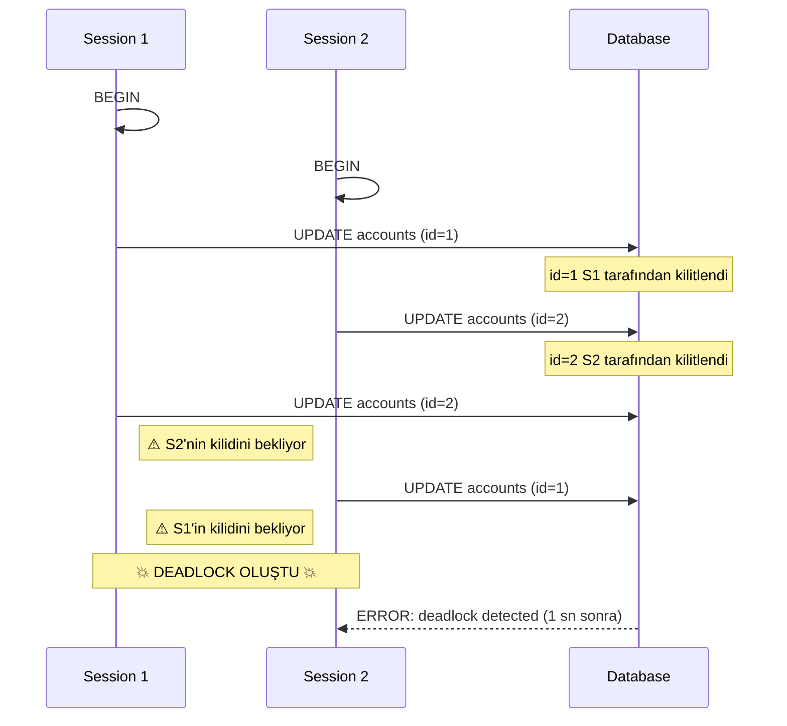

# Eşzamanlılık, İzolasyon Seviyeleri ve Kilit Yönetimi

> **Bölüm Kapsamı:** Transaction İzolasyon Seviyeleri, MVCC Mekaniği, Satır ve Tablo Kilitleri, Deadlock Çözümü

---

## 1. Transaction Isolation Levels (İzolasyon Seviyeleri)

SQL standardı 4 izolasyon seviyesi tanımlar, ancak PostgreSQL pratikte 3'ünü destekler.

| Seviye | Dirty Read | Non-Repeatable Read | Phantom Read | PostgreSQL'de Geçerli mi? |
| :------- | :----------- | :-------------------- | :------------- | :-------------------------- |
| Read Uncommitted | Evet | Evet | Evet | Hayır (Read Committed gibi davranır) |
| Read Committed | Hayır | Evet | Evet | ✅ (Varsayılan) |
| Repeatable Read | Hayır | Hayır | Hayır* | ✅ |
| Serializable | Hayır | Hayır | Hayır | ✅ |

\* PostgreSQL'de Repeatable Read, Phantom Read'i de önler (Snapshot Isolation sayesinde).

### Read Committed (Varsayılan)

Her statement (SELECT, UPDATE vb.), başladığı andaki commit edilmiş veriyi görür. Transaction içinde birden fazla SELECT çalıştırırsanız, aralarında başka transaction'lar commit ederse farklı sonuçlar alabilirsiniz.

```sql
-- Session 1
BEGIN;
SELECT balance FROM accounts WHERE id = 1; -- 1000 TL
-- Session 2 bu sırada balance'ı 1500 TL yapar ve COMMIT eder
SELECT balance FROM accounts WHERE id = 1; -- 1500 TL (Değişti!)
COMMIT;
```

### Repeatable Read

Transaction boyunca tüm SELECT'ler, transaction başladığı andaki "anlık görüntü"yü (Snapshot) görür.

```sql
-- Session 1
BEGIN TRANSACTION ISOLATION LEVEL REPEATABLE READ;
SELECT balance FROM accounts WHERE id = 1; -- 1000 TL
-- Session 2 bu sırada balance'ı 1500 TL yapar ve COMMIT eder
SELECT balance FROM accounts WHERE id = 1; -- Hala 1000 TL
COMMIT;
```

### Serializable

En güvenli seviye. Eğer iki transaction'ın eş zamanlı çalışması tutarsızlık yaratabilecekse, PostgreSQL birini iptal eder ve `serialization failure` hatası verir. Uygulamanız bu hatayı yakalayıp transaction'ı yeniden başlatmalıdır.

```sql
BEGIN TRANSACTION ISOLATION LEVEL SERIALIZABLE;
-- İşlemler...
COMMIT;
-- Hata alınırsa: ROLLBACK yap ve tekrar dene
```

---

## 2. Locking (Kilitleme) Mekanizmaları

PostgreSQL'de iki ana kilit türü vardır: **Table-Level** ve **Row-Level**.

### a. Row-Level Locks (Satır Seviyesi Kilitler)

En yaygın kilit türüdür. Sadece etkilenen satırları kilitler. PostgreSQL 4 farklı satır kilidi modu sunar:

| Komut | Kilit Türü | Açıklama |
| :------ | :----------- | :--------- |
| `SELECT FOR UPDATE` | Exclusive Row Lock | Satırı tamamen kilitler; başka hiçbir transaction UPDATE, DELETE veya kilitli SELECT yapamaz. |
| `SELECT FOR NO KEY UPDATE` | No Key Exclusive | Primary Key haricindeki alanları UPDATE edecek işlemler için uygundur; `FOR KEY SHARE`'i engellemez. |
| `SELECT FOR SHARE` | Shared Row Lock | Satırın silinmesini ve güncellenmesini engeller; diğer transaction'ların okumasına ve `FOR SHARE` kilidi almasına izin verir. |
| `SELECT FOR KEY SHARE` | Key Shared Lock | Yabancı anahtar (FK) bütünlüğü için kullanılır; anahtar sütunları değiştirmeyen UPDATE'lere izin verir. |
| `UPDATE` / `DELETE` | Exclusive Row Lock | Otomatik olarak konur (Transaction bitene kadar geçerlidir). |

```sql
-- Para transferi (Race condition'dan korunma)
BEGIN;
SELECT balance FROM accounts WHERE id = 1 FOR UPDATE;
-- Bu satır kilitli, başka transaction bekler
UPDATE accounts SET balance = balance - 100 WHERE id = 1;
COMMIT;
```

### b. Table-Level Locks (Tablo Seviyesi Kilitler)

Tüm tabloyu etkiler. Genellikle DDL işlemlerinde (ALTER TABLE, CREATE INDEX vb.) kullanılır.

```sql
-- Manuel kilitleme (Nadiren gerekir)
BEGIN;
LOCK TABLE accounts IN EXCLUSIVE MODE;
-- Artık kimse bu tabloya dokunamaz
COMMIT;
```

### c. Deadlock (Kilitlenme)

İki transaction birbirini bekler hale gelirse "deadlock" oluşur.



```sql
-- Session 1
BEGIN;
UPDATE accounts SET balance = balance - 100 WHERE id = 1;
-- Session 2
BEGIN;
UPDATE accounts SET balance = balance + 100 WHERE id = 2;
-- Session 1 (bekler, çünkü Session 2 kilitledi)
UPDATE accounts SET balance = balance + 100 WHERE id = 2;
-- Session 2 (bekler, çünkü Session 1 kilitledi)
UPDATE accounts SET balance = balance - 100 WHERE id = 1;

-- PostgreSQL 1 saniye sonra birini otomatik iptal eder:
-- ERROR: deadlock detected
```

**Önleme Stratejisi:** Kaynakları her zaman aynı sırada kilitleyin (örn: ID'ye göre sıralı).

---

## 3. MVCC İçi Mekanikleri (Deep Dive)

Bölüm 01'de MVCC'nin temel mantığını anlattık. Şimdi teknik detaylara girelim.

### Tuple Versioning

Her satırın (tuple) kendine ait metadata'sı vardır:

- **xmin:** Bu satırı oluşturan transaction ID'si.
- **xmax:** Bu satırı silen/güncelleyen transaction ID'si (0 ise hala "canlı").
- **ctid:** Satırın fiziksel konumu (Page + Offset).

```sql
-- Gizli sütunları görmek
SELECT xmin, xmax, ctid, * FROM users LIMIT 5;
```

### Visibility Rules

Bir transaction bir satırı gördüğünde, şu kuralları kontrol eder:

1. **xmin < current_transaction_id** ve **xmin committed** mi? → Satırı görebilir, devam et.
2. **xmax == 0** veya **xmax > current_transaction_id** veya **xmax uncommitted** mi? → Satır hala canlı, göster.
3. Aksi halde satır "ölü", gösterme.

Bu yüzden `UPDATE` işlemi, eski satırı silmez, sadece `xmax`'ini set eder ve yeni satır ekler. `VACUUM` daha sonra "ölü" satırları fiziksel olarak siler.

---

## 4. pg_locks (Kilitleri İzleme)

### Temel Lock Monitoring

```sql
SELECT 
    l.locktype,
    l.mode,
    l.granted,
    a.usename,
    a.query
FROM pg_locks l
JOIN pg_stat_activity a ON l.pid = a.pid
WHERE NOT l.granted;
-- Bekleyen (granted=false) kilitleri gösterir.
```

### Lock Türleri (8 Tablo Kilit Modu)

PostgreSQL'de zayıftan güçlüye doğru tam 8 farklı tablo kilit modu vardır:

| Lock Mode | Kullanıldığı Başlıca Komutlar | Çakıştığı Kilitler |
| :--- | :--- | :--- |
| **AccessShareLock** | `SELECT` | Sadece `AccessExclusiveLock` ile çakışır |
| **RowShareLock** | `SELECT FOR SHARE`, `SELECT FOR UPDATE` | `ExclusiveLock`, `AccessExclusiveLock` |
| **RowExclusiveLock** | `INSERT`, `UPDATE`, `DELETE` | `ShareLock`, `ShareRowExclusiveLock`, `ExclusiveLock`, `AccessExclusiveLock` |
| **ShareUpdateExclusiveLock** | `VACUUM` (standart), `ANALYZE`, `CREATE INDEX CONCURRENTLY` | Kendisi dahil `ShareUpdateExclusiveLock` ve üzeri tüm kilitlerle çakışır |
| **ShareLock** | `CREATE INDEX` (standart) | `RowExclusiveLock`, `ShareUpdateExclusiveLock`, `ShareRowExclusiveLock`, `ExclusiveLock`, `AccessExclusiveLock` |
| **ShareRowExclusiveLock** | `CREATE TRIGGER`, `ALTER TABLE` bazı formları | `RowExclusiveLock`, `ShareUpdateExclusiveLock`, `ShareLock` ve üzeri |
| **ExclusiveLock** | `REFRESH MATERIALIZED VIEW CONCURRENTLY` | `RowShareLock` ve üzeri neredeyse tüm kilitler |
| **AccessExclusiveLock** | `DROP TABLE`, `TRUNCATE`, `ALTER TABLE`, `VACUUM FULL` | **TÜM** kilitlerle çakışır (okumayı dahi bloke eder) |

### Blocking Queries (Kimin Kimi Beklediği)

```sql
SELECT 
    blocked_locks.pid AS blocked_pid,
    blocked_activity.usename AS blocked_user,
    blocking_locks.pid AS blocking_pid,
    blocking_activity.usename AS blocking_user,
    blocked_activity.query AS blocked_statement,
    blocking_activity.query AS blocking_statement,
    blocked_activity.application_name AS blocked_app
FROM pg_catalog.pg_locks blocked_locks
JOIN pg_catalog.pg_stat_activity blocked_activity ON blocked_activity.pid = blocked_locks.pid
JOIN pg_catalog.pg_locks blocking_locks 
    ON blocking_locks.locktype = blocked_locks.locktype
    AND blocking_locks.database IS NOT DISTINCT FROM blocked_locks.database
    AND blocking_locks.relation IS NOT DISTINCT FROM blocked_locks.relation
    AND blocking_locks.pid != blocked_locks.pid
JOIN pg_catalog.pg_stat_activity blocking_activity ON blocking_activity.pid = blocking_locks.pid
WHERE NOT blocked_locks.granted;
```

### Lock Wait Timeout Ayarlama

```sql
-- Session bazında timeout (30 saniye)
SET lock_timeout = '30s';

-- Veya global olarak postgresql.conf:
-- lock_timeout = 30s

-- Örnek kullanım:
BEGIN;
SET LOCAL lock_timeout = '5s';
UPDATE products SET price = price * 1.1 WHERE category = 'electronics';
-- 5 saniye içinde kilit alınamazsa ERROR verir
COMMIT;
```

---

## 5. Best Practices

1. **Kısa Transaction'lar:** Transaction'ı sadece gerekli işlemle sınırlı tutun. Kullanıcı inputu transaction içinde almayın!
2. **`SELECT FOR UPDATE SKIP LOCKED`:** Kilitlenmiş satırları atla, diğerlerini işle (Job queue pattern için ideal).

```sql
SELECT * FROM job_queue 
WHERE status = 'pending' 
FOR UPDATE SKIP LOCKED 
LIMIT 1;
```

3. **Connection Pooling:** Her transaction için yeni bağlantı açmayın, PgBouncer kullanın.
